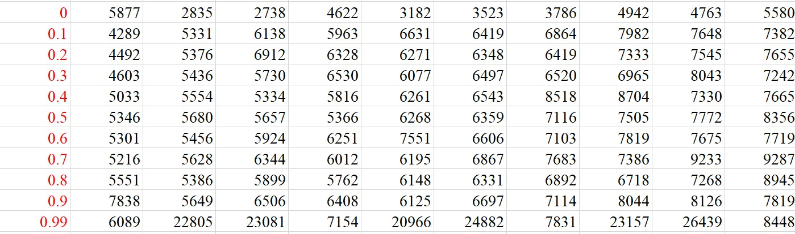

# Evaluation

> **Table 1**: average time measured in milliseconds with equal load-probability for each node

Firstly, we set 4 computer nodes. Each of them has equal load probability range from 0 – 0.99. In this situation, we have 11 test cases in total. For each test case, we run 10 times and compute the average. Then for each load-probability, we have average time for elapsed time, average time of compute node 1,2,3,4 each execute tasks received. According to these data, we draw the following plot.

We could clearly see from the chart when the load-probability is 0, the total elapsed time is the smallest. In addition, as the load-probability increase, the elapsed time keeps increasing but the increase level is not so steep until the load-probability reaches 0.99, the elapsed time increases sharply comparing to the load-probability 0.9.

As for the trend of average running time for each compute node, it decreases first when the load probability increases and then it would increase again. When it comes to the extreme 0.99 case, it would suddenly decrease a large amount. Since when P is relatively small, if P increases, it would enlighten the blocking situation as there won’t be as much number of tasks are queue as the previous smaller P case. Therefore, the efficiency would go higher. As for the P is relatively larger, the probability of service getting rejected increases, also there would be higher chance to inject load time, then the running time would no doubt arise. However, for the extreme 0.99 case, because each compute node would extremely prefer to reject the task, then there would be least amount of files enqueued, then the average running time of computer node is small.

> **Table 2**: elapsed time for 4 compute nodes with equal load-probability

> **Chart 2**: the total elapsed time for all compute node with load-probability as 0.

We could clearly see from the trend that only the first one has extreme large time comparing to the followings, since if running the whole process for the first time, the network file system needs to load the data into buffer which needs quite a bit amount of time resulting the time usually larger.

> **Table 3**: average time measured in milliseconds with various load-probability for each node

## Negative case

In this project, we can assume the Server and the Client will not break down. However, we cannot make sure the input of each command line parameter. Below are some negative test cases that can show our system has robustness.

For the Compute Nodes, they are not exposed to users. When running the Compute Node, a configuration file name is required. If the we do not provide the file name, Compute Node will return false and give the error message to the terminal. If the file does not exist, our program will give an error message “file not exist”.
For the Server, if one Compute Node is shutdown, the server will try to assign the task to another Compute Node and give an exception message in command line. But the Server will not break down, it will ensure every task is assigned and finished. Below is a picture from the terminal of the Server. And this message will not be shown to the user (Client), so the user will never know there is one Compute Node breaks down.

For the Client, we require to input a file directory instead of a file list, and the program will try to add all files in this directory (and this part is required in README file), so there will not be any exception in Client side.

